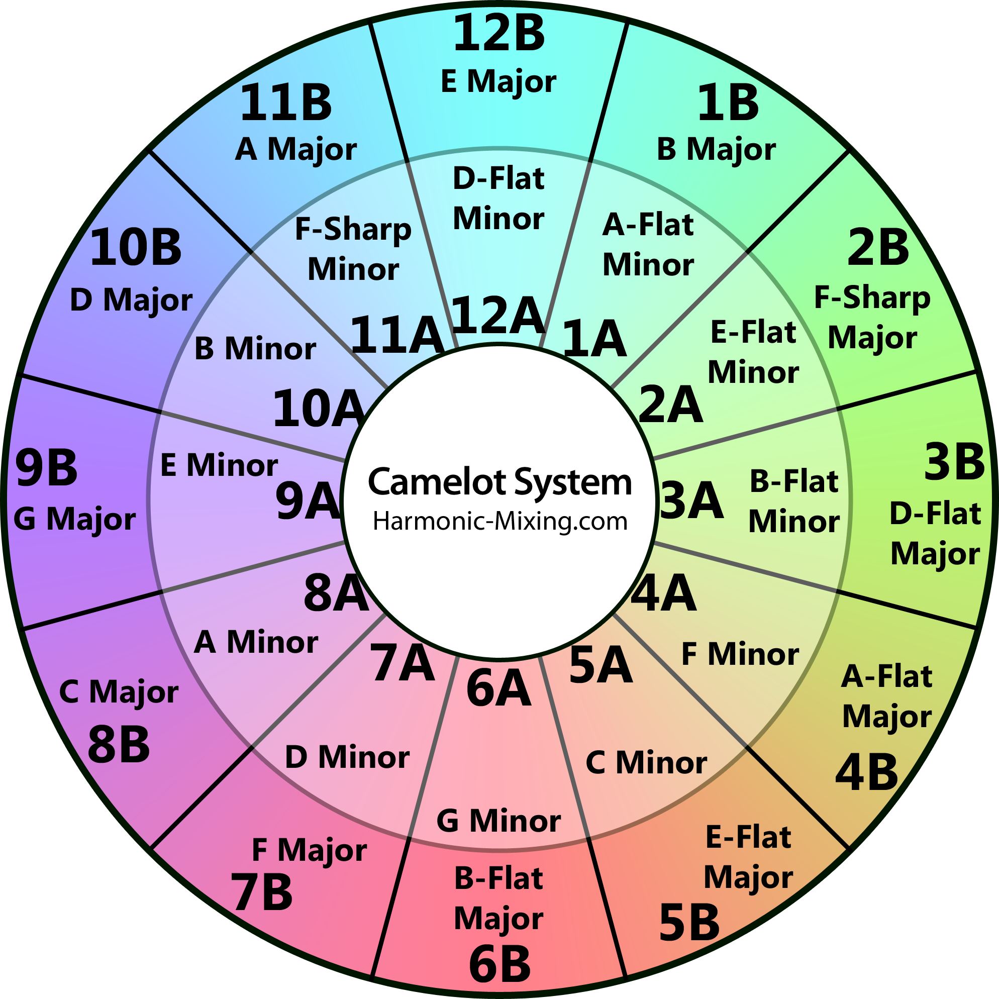

# Camelot-Wheel

A package to allow for easy use of logic related the Circle of Fifths or 'Camelot Wheel'.

The Circle of Fifths shows the relationships among the twelve tones of the Chromatic Scale, their corresponding key signatures and the associated Major and Minor keys.

In lay terms: The Circle of Fifths is a music theory diagram for finding the key of a song, transposing songs to different keys, composing new songs and understanding key signatures, scales, and modes.

### Usage

#### Install

`npm i camelot-wheel`

## How does it work?

We use the spotify API to get the track features for a song. The most important information we use is the tempo, the key and the mode.

- Tempo is the speed of the track in beats per minute (BPM)
- Key is the group of pitches and scale of the composition. Integers represent each key. For example C = 0, C# = 1, D = 2 etc.
- Mode is whether it is in the minor or Major key. 1 = Major. 0 = Minor

We then ask Spotify for a list of recommendations based on this information.

This is where the Camelot Wheel comes in.

### The Camelot Wheel



Now what is going on here?

- Each number represents a key as stated above.
- The outside of the wheel represents the Major mode and the inside of the wheel represents the Minor mode.
- A track's key is considered compatible with another if it's positioned next to it or opposite it.
- For example the key of C (1d) is compatible with F (12d), G (2d) and Am (1m)

### API

getKeyByPitchClassAndMode
getKeyByCamelotPositionAndMode
getHarmonicKeys
getCamelotRoute

### API

It's easy to use Camelot-Wheel APIs to navigate the circle of fifths, get keys by position in the camelot wheel, get keys by pitch class and mode, get harmonically related keys, and get a suggested route through harmonically related keys, from key A to key B.

##### getKeyByPitchClassAndMode(pitchClass, mode);

```javascript
e.g.getKeyByPitchClassAndMode(0, 1); // ==> C  (major)
getKeyByPitchClassAndMode(0, 0); // ==> Cm (minor)
```

##### getKeyByCamelotPositionAndMode(camelotPosition, mode);

```javascript
e.g.getKeyByCamelotPositionAndMode(8, 1); // => C (major)
```

##### getHarmonicKeys(pitchClass, mode);

```javascript
e.g.getHarmonicKeys(0, 1);
// => [{ camelotPosition: 8, mode: 1, name: "C", pitchClass: 0 },
//    { camelotPosition: 7, mode: 1, name: "F", pitchClass: 5 },
//    { camelotPosition: 9, mode: 1, name: "G", pitchClass: 7 },
//    { camelotPosition: 8, mode: 0, name: "Am", pitchClass: 9 }]
```

##### getCamelotRoute(startKey, targetKey);

```javascript
e.g.getCamelotRoute({ pitchClass: 5, mode: 1 }, { pitchClass: 9, mode: 1 });
// => [
//      { name: "C", pitchClass: 0, mode: 1, camelotPosition: 8 },
//      { name: "G", pitchClass: 7, mode: 1, camelotPosition: 9 },
//      { name: "D", pitchClass: 2, mode: 1, camelotPosition: 10 }
//    ]
```

### Run the Tests

```
npm test
```
